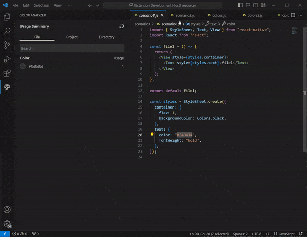
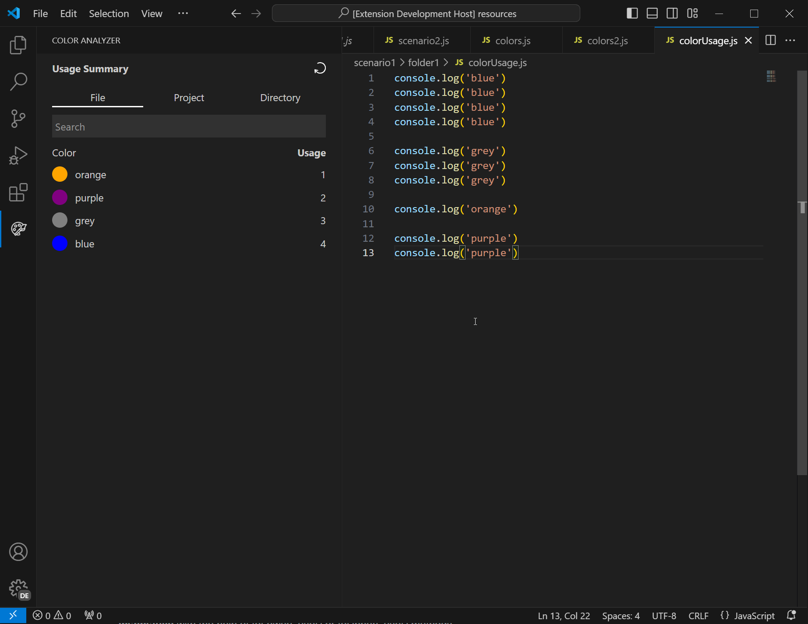
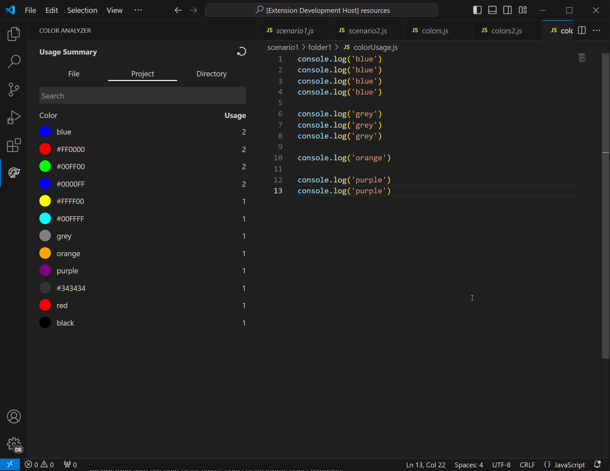
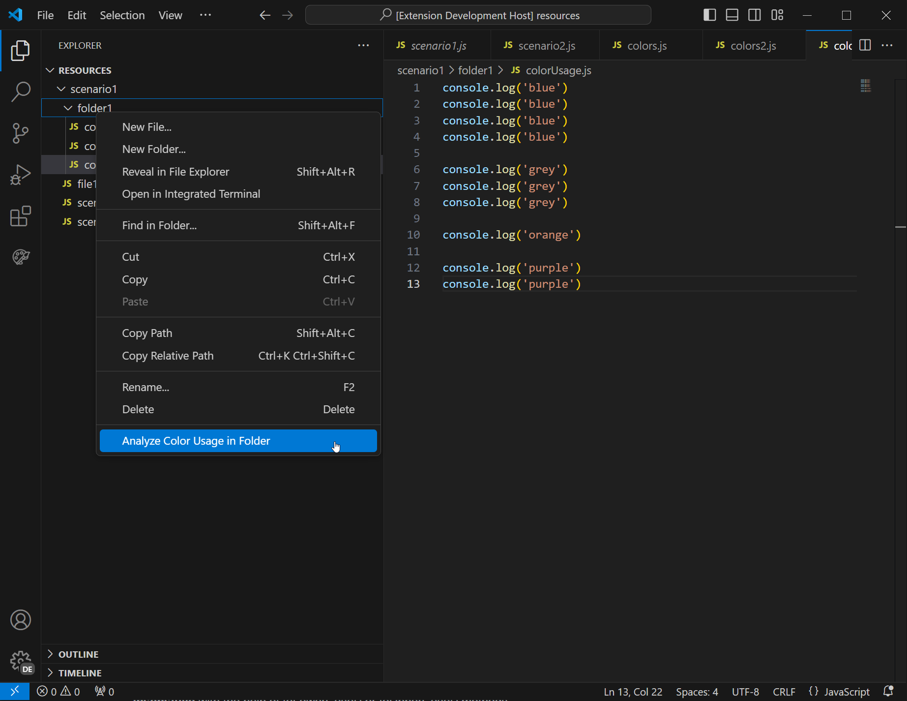
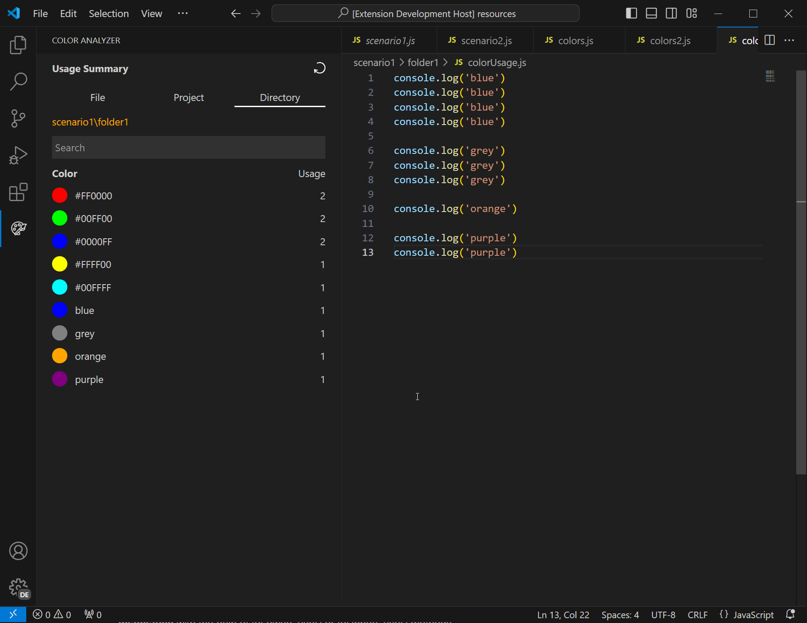

# VS Code Extension for Viewing Color Used in Project

**Features**

- Analyze colors used in a project/file
- Quickly navigate to the color used in a file

**Screenshot**
 
Demo:
 

 

1. Analyze by file
   
    
2. Analyze by project
   
    
3. Analyze by selected directory
   
   
